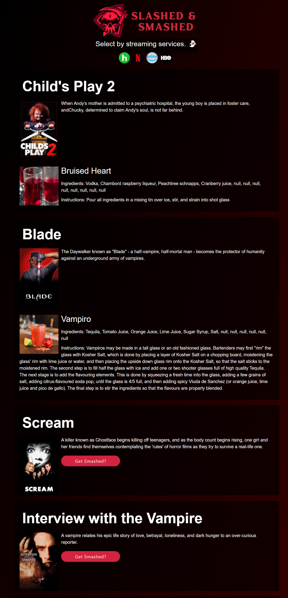

# Slashed and Smashed

## User Story

AS A horror film buff\
I WANT an application to present me with a random list of horror movies by streaming service\
SO THAT I can quickly select a movie without having to browse streaming services

## Acceptance Criteria

Given a random horror film generator\
WHEN I load the page\
THEN I am presented with 10 of most popular horror movies at the time\
WHEN I select a streaming service\
THEN I am presented with movie results for that streaming service that includes the movie title, poster, description, and year.\
WHEN I am presented with movie results\
THEN I am also presented with an option for a random spooky themed cocktail\

## Description

This is a web application that presents the user with a list of horror movies paired with horror themed cocktail recipes. 

## Usage

- Upon loading the page, the user is presented with ten popular horror movies that have been pulled from the "The Movie Database" API. 

- Under each movie's description is a "get smashed?" button that, when pressed, displays data for a random, horror-themed cocktail from the "Cocktail db" API.

-  When a user presses one of the streaming service icons at the top of the page, the initial list of movies is replaced with a list of horror movies that are available on that particular streaming service. 

- Pressing the logo at the top of the page will reload the page.

## Credits

Movie of the Night API: https://rapidapi.com/movie-of-the-night-movie-of-the-night-default/api/streaming-availability/

The Movie db API: https://www.themoviedb.org/?language=en-US

The Cocktail db API: https://www.thecocktaildb.com/

## Assets

https://jnighton.github.io/Horror-Finder/

file:///C:/Users/Jakob%20Dayton/Assignments/Horror-Finder/index.html
